## Hi there ❤️❤️❤️

<h1 align="center">
  <strong>
    Senior Software Engineer
  </strong>
</h2>

<h3><strong>🖋️ Summary</strong></h3>
  <ul>
    

    Senior Software Engineer with over 11
years of experience delivering high-impact, innovative web and mobile
applications. Specialized in building
Javascript modules, libraries, scalable web and mobile solutions using React, Next.js,Angular, React Native, Laravel, Node.js, Nest.js. Led the development of several websites and
platforms across various industries,
including adtech, fintech, and e- commerce, driving significant
improvements in user engagement and
retention. Proven expertise in building
scalable, responsive user interfaces, managing cross-functional teams, and
integrating third-party solutions. Consistently staying updated with the
latest trends and advancements.
    

  </ul>

<h3><strong>📊 Stats</strong></h3>
      

<h3><strong>🥼 Expertise</strong></h3>
  <ul>
    <li>Front-End Engineering: Over 11 years of experience specializing in building modern, interactive, and scalable web and mobile applications.</li>
    <li>UI/UX Engineering: Skilled in creating responsive, user-friendly interfaces using technologies like React, Next.js, Angular, and React Native. </li>
    <li>Design Systems & Styling: Deep experience with CSS-in-JS, Tailwind CSS, SCSS, Material UI, Chakra UI, Ant Design, and Styled Components.
    </li>
    <li>Cross-Platform Development: Extensive background in building applications for web and mobile, including real-time features and platform-optimized experiences.
    </li>
    <li>Team & Project Leadership: Proven ability to lead cross-functional teams, manage feature lifecycles, and deliver results across various industries (adtech, fintech, e-commerce).</li>
  </ul>

<h3><strong>🌟 Specialization</strong></h3>
  <ul>
    <li>JavaScript / TypeScript</li>
    <li>React Ecosystem ( React, Next.js, Redux/Zustand, React Native )</li>
      <li>Frameworks & Tools ( Laravel, Angular, GraphQL, Firebase, AWS Lambda, CI/CD, Git/Github )</li>
         <li>Module & Libraries</li>

  </ul>

  <h3><strong>📌Serving Industries</strong></h3>
  <ul>
    <li>Adtech</li>
    <li>Fintech</li>
      <li>E-commerce</li>
         <li>Mobility / Delivery Services</li>
<li>Real Estate</li>
         <li>Social & Communication Tools </li>
         

  </ul>

<h3><strong>🔮 Skill Set </strong></h3>
  <table width="100%" style="border: 1px solid">
    <thead align="center">
      <tr style="border: 1px solid">
        <td style="border: 1px solid">Language</td>
        <td style="border: 1px solid">Frontend</td>
        <td style="border: 1px solid">Cloud</td>
        <td style="border: 1px solid">Backend</td>
      </tr>
    </thead>
    <tbody>
      <tr>
        <td valign="top" style="border: 1px solid">
           <ul>
           <li>JavaScript</li>
           <li>TypeScript</li>
           <li>Python</li>
           <li>PHP</li>
           <li>C#</li>
           <li>C++</li>
           </ul>
        </td>
        <td valign="top" style="border: 1px solid">
         <li>React</li>
           <li>Next.js</li>
             <li>React Native</li>
            <li>Angular</li>
           <li>Vue.js</li>
            <li>Laravel</li>
        </td>
       <td>
          <li>Firebase</li>
           <li>Supabase</li>
              <li>AWS Lambda</li>
           <li>Git/Github, GitBucket, GitLab</li>
              <li>Vercel</li>
           <li>Netlify</li>
        </td>
        <td>
          <li>Node.js</li>
          <li>Nest.js</li>
        </td>
    </tbody>
  </table>

<h3><strong>🔖 Project</strong></h3>
  <h4><strong>🌐 Web & Mobile</strong></h4>
    <table align="center" style="border: 1px solid">
      <thead align="center">
        <tr align="center">
          <th align="center" style="border: 1px solid">Advida</th>
          <th align="center" style="border: 1px solid">Hash Director</th>
          <th align="center" style="border: 1px solid">Sparrow</th>
          <th align="center" style="border: 1px solid">Fiverr</th>
        </tr>
      </thead>
      <tbody align="center">
        <tr>
          <td style="border: 1px solid">
            <a href="https://advida.com/">
              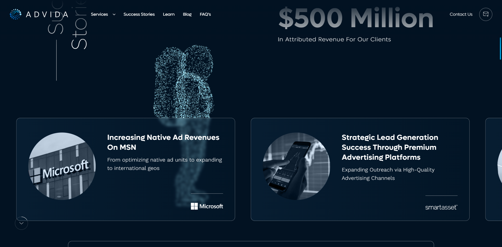
            </a>
          </td>
          <td style="border: 1px solid">
            <a href="https://hashdirectors.com/">
              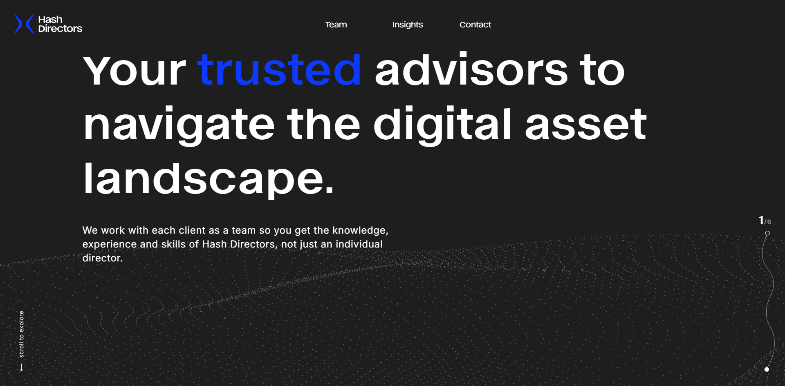
            </a>
          </td>
          <td style="border: 1px solid">
            <a href="https://sparrowcard.com/">
              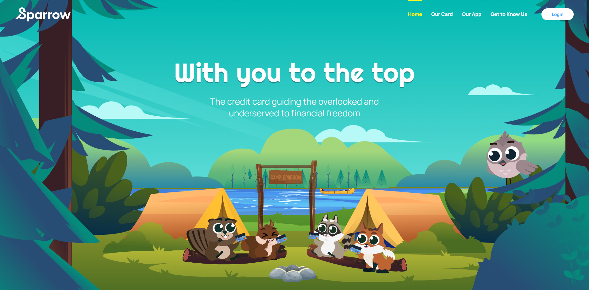
            </a>
          </td>
          <td style="border: 1px solid">
            <a href="https://www.fiverr.com/">
              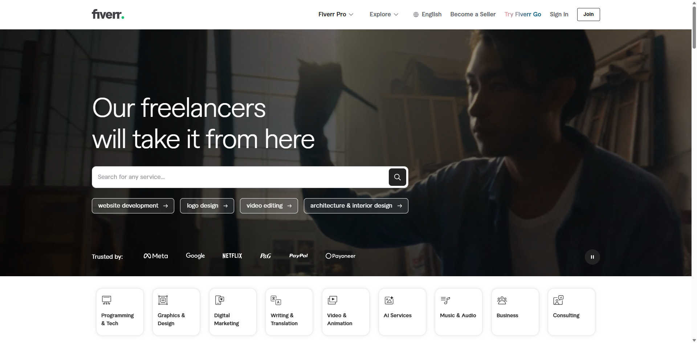
            </a>
          </td>
        </tr>
      </tbody>
    </table>
    <table align="center" style="border: 1px solid">
      <thead align="center">
        <tr align="center">
          <th align="center" style="border: 1px solid">MyBikePlan</th>
          <th align="center" style="border: 1px solid">Roomster</th>
          <th align="center" style="border: 1px solid">Zenduit</th>
          <th align="center" style="border: 1px solid">Rockwell</th>
        </tr>
      </thead>
      <tbody>
        <tr>
          <td style="border: 1px solid">
            <a href="https://www.mybikeplan.ch/">
              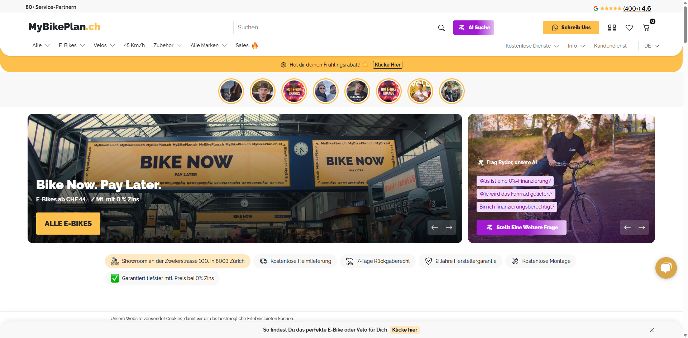
            </a>
          </td>
          <td style="border: 1px solid">
            <a href="https://roomster.com/">
              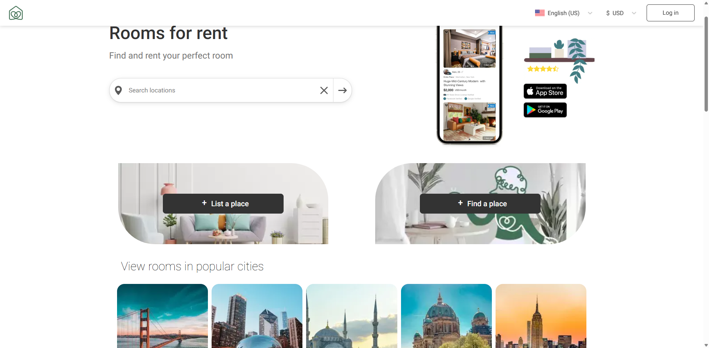
            </a>
          </td>
          <td style="border: 1px solid">
            <a href="https://zenduit.com/">
              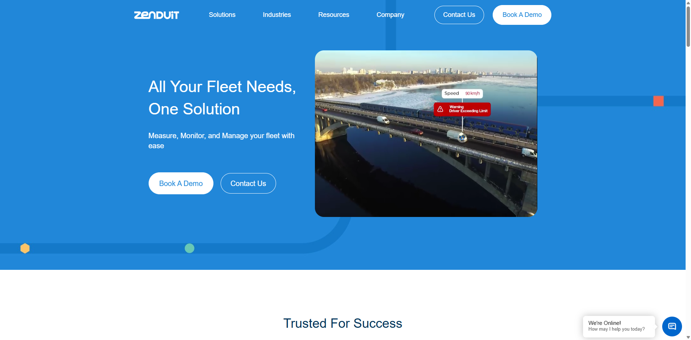
            </a>
          </td>
          <td style="border: 1px solid">
            <a href="https://www.rockwelltrading.com/">
              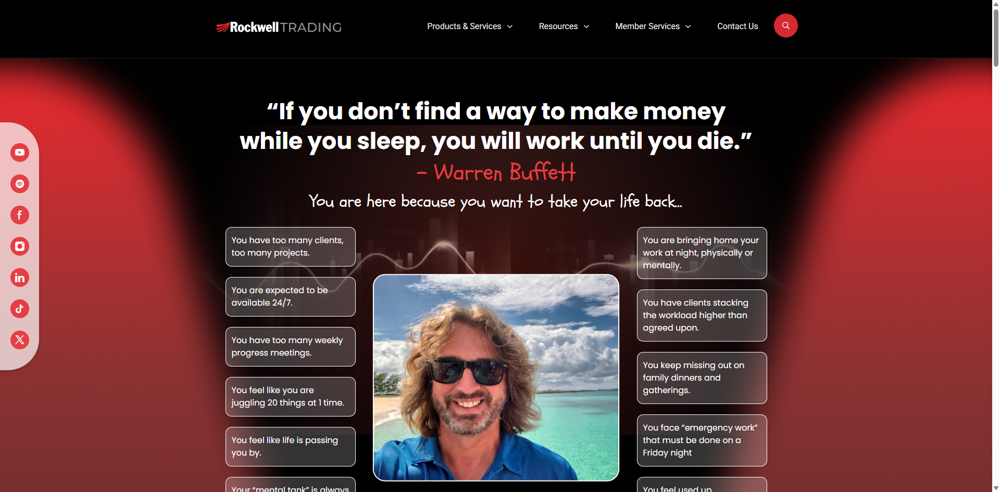
            </a>
          </td>
        </tr>
      </tbody>
    </table>
 <table align="center" style="border: 1px solid">
      <thead align="center">
        <tr align="center">
          <th align="center" style="border: 1px solid">15sof</th>
          <th align="center" style="border: 1px solid">Zid</th>
          <th align="center" style="border: 1px solid">Kinlia</th>
        </tr>
      </thead>
      <tbody>
        <tr>
          <td style="border: 1px solid">
            <a href="https://15sof.com/">
              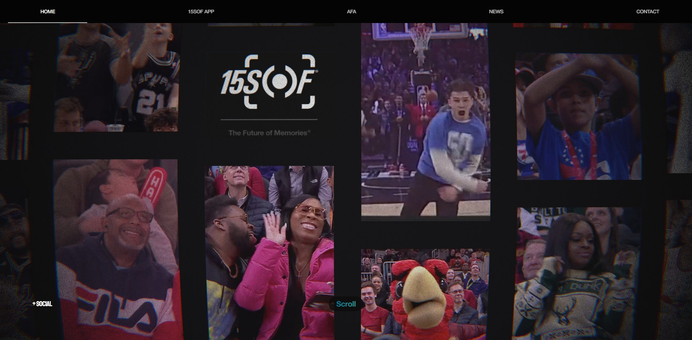
            </a>
          </td>
          <td style="border: 1px solid">
            <a href="https://zid.sa/">
              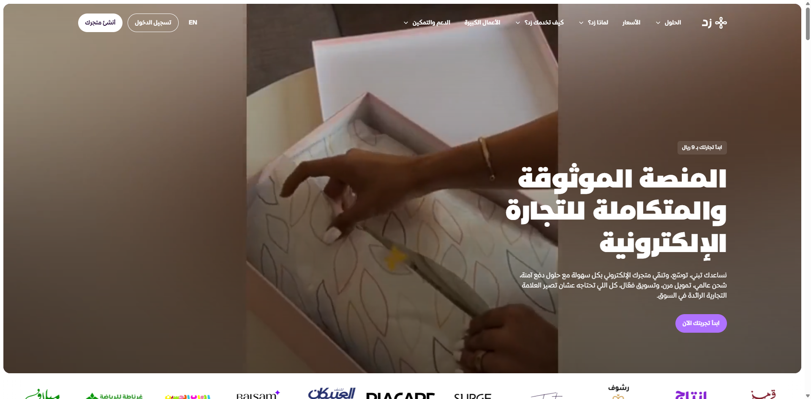
            </a>
          </td>
          <td style="border: 1px solid">
            <a href="https://www.kinlia.com/">
              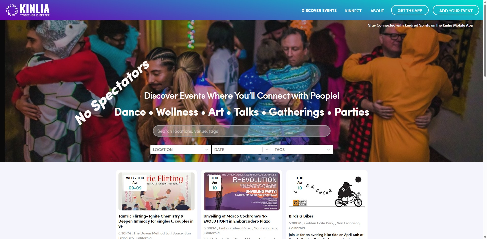
            </a>
          </td>
        </tr>
      </tbody>
    </table>
    <table align="center" style="border: 1px solid">
      <thead align="center">
        <tr align="center">
          <th align="center" style="border: 1px solid">Otoqi</th>
          <th align="center" style="border: 1px solid">Sendy</th>
          <th align="center" style="border: 1px solid">Homodea</th>
          <th align="center" style="border: 1px solid">UprightPose</th>
        </tr>
      </thead>
      <tbody>
        <tr>
          <td style="border: 1px solid">
            <a href="https://en.otoqi.com/">
              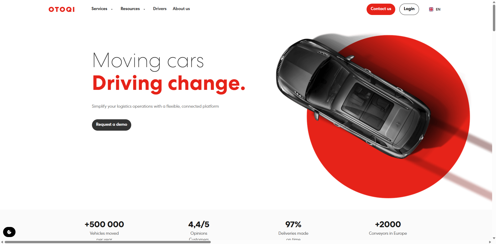
            </a>
          </td>
          <td style="border: 1px solid">
            <a href="https://sendy.io/">
              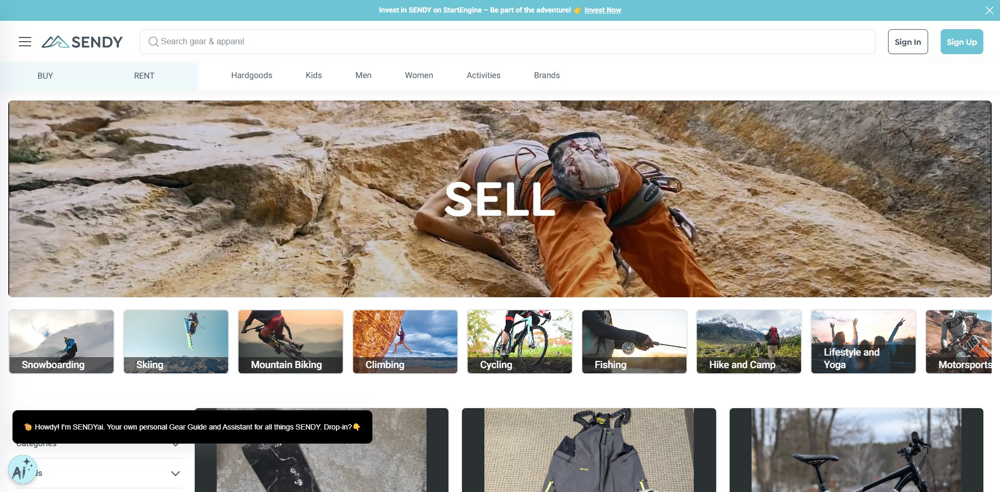
            </a>
          </td>
          <td style="border: 1px solid">
            <a href="https://hd5.homodea.com/">
              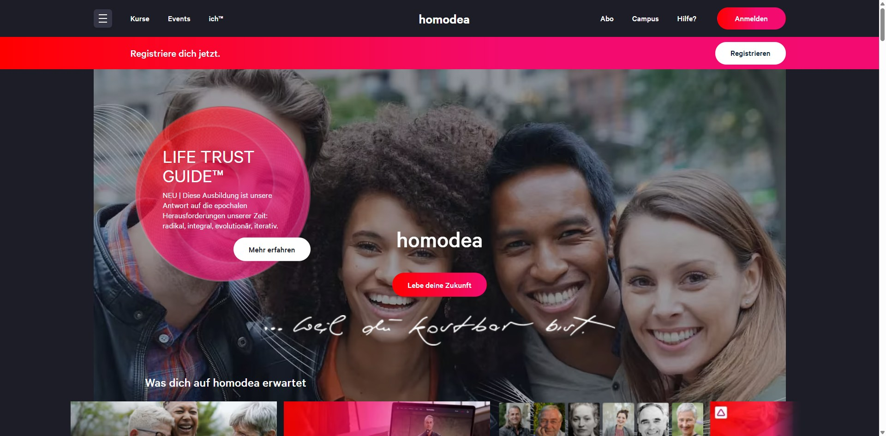
            </a>
          </td>
          <td style="border: 1px solid">
            <a href="https://www.uprightpose.com/">
              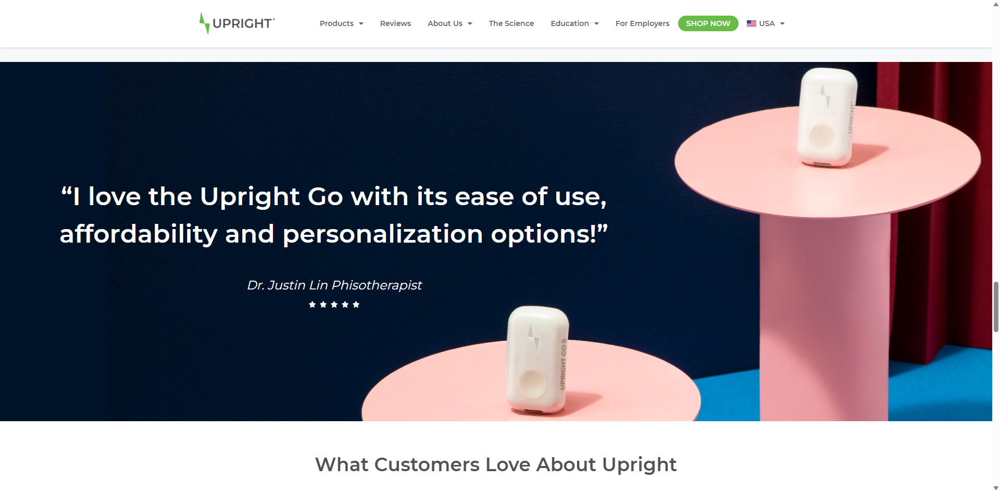
            </a>
          </td>
        </tr>
      </tbody>
    </table>
<table align="center" style="border: 1px solid">
      <thead align="center">
        <tr align="center">
          <th align="center" style="border: 1px solid">SuperChat</th>
          <th align="center" style="border: 1px solid">IdMe</th>
        </tr>
      </thead>
      <tbody>
        <tr>
          <td style="border: 1px solid">
            <a href="https://www.superchat.com/">
              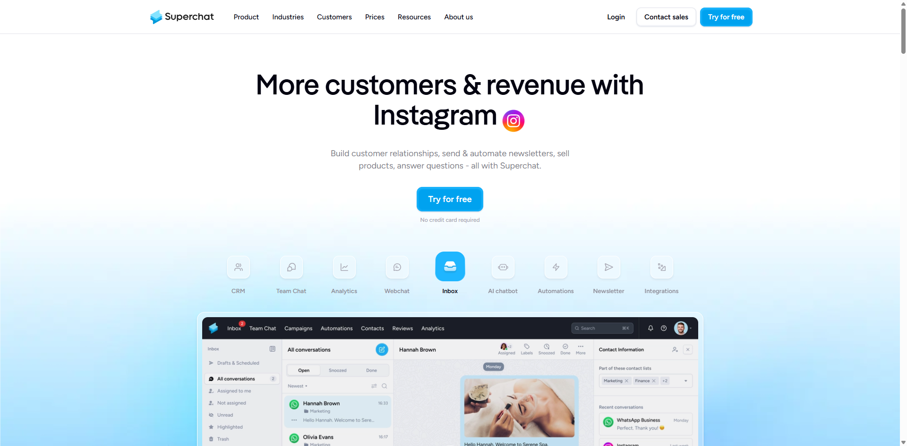
            </a>
          </td>
          <td style="border: 1px solid">
            <a href="https://idme911.com/">
              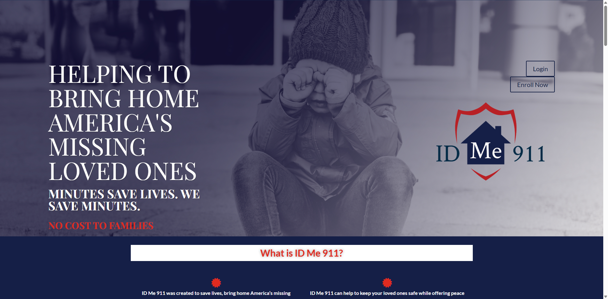
            </a>
          </td>
        </tr>
      </tbody>
    </table>
    
  
